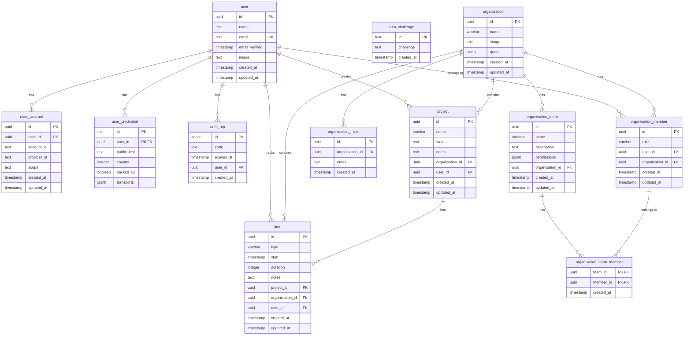

# @zeity/database

Database schemas and utilities for Zeity using Drizzle ORM.

## Overview

This package contains all database table definitions, types, and utilities for the Zeity application. It uses Drizzle ORM with PostgreSQL.

## Usage

This is an internal workspace package. It's automatically available to all apps in the monorepo.

```typescript
import { users } from '@zeity/database/user';
import { eq, useDrizzle } from '@zeity/database';
```

### Importing Tables

```typescript
// Import specific tables
import { users } from '@zeity/database/user';
import { organisations } from '@zeity/database/organisation';
import { times } from '@zeity/database/time';

// Import all from schema
import * as schema from '@zeity/database/schema';
```

## Common Patterns

### Timestamp Columns

All tables use the `timestampColumns` helper:

```typescript
import { timestampColumns } from '@zeity/database/common';

export const myTable = pgTable('my_table', {
  id: uuid('id').defaultRandom().primaryKey(),
  // ... other fields
  ...timestampColumns(),  // Adds createdAt and updatedAt
});
```

## Development

### Adding New Tables

1. Create new file in `src/`: `src/my-table.ts`
2. Define table schema using Drizzle
3. Export types
4. Add to `src/schema.ts`
5. Generate migration

### Modifying Tables

1. Edit table definition in `src/`
2. Generate migration: `pnpm db:generate`
3. Review migration in migrations folder
4. Migrations will be applied automatically

## Schema Export

All tables are re-exported from `src/schema.ts` for convenience:

```typescript
import * as schema from '@zeity/database/schema';

// Access any table
schema.users
schema.organisations
schema.times
// etc.
```

## Schema Diagram




